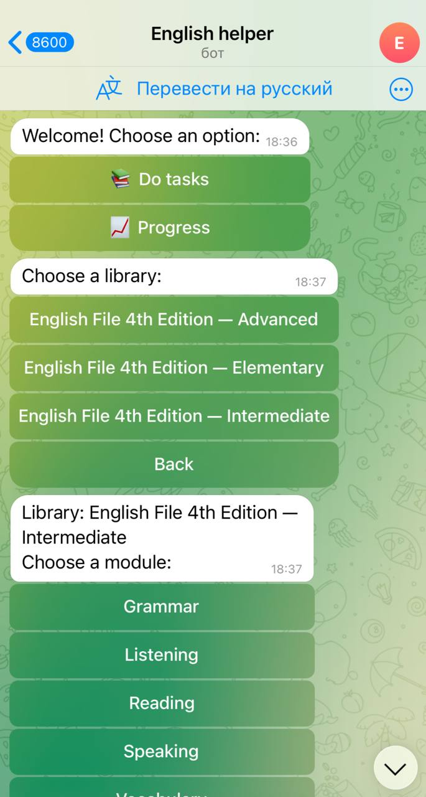
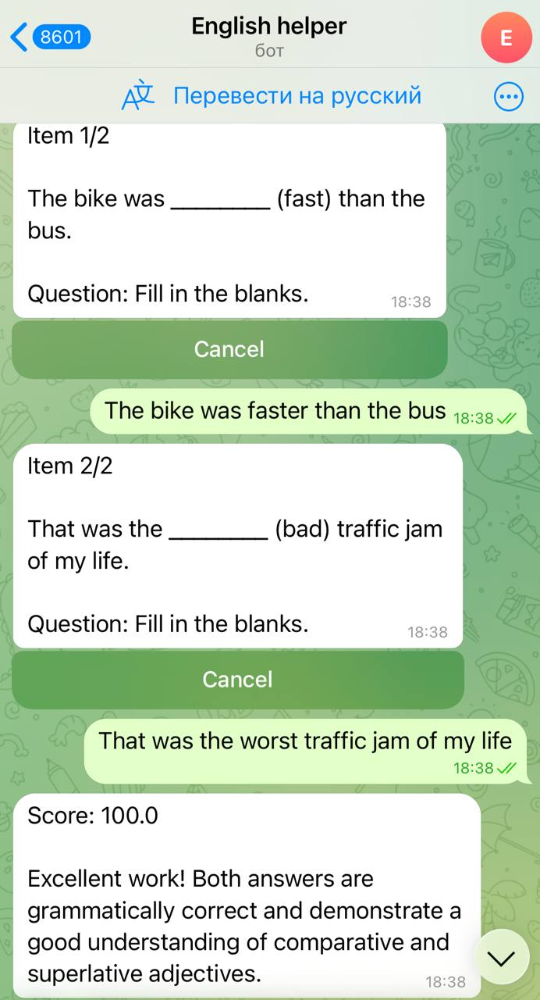

# English Helper Bot

Telegram bot for guided English practice with structured task libraries, automatic scoring, progress tracking, and a clean callback-based user flow.

This public repository is a sanitized showcase version. It contains the application architecture and a small demo task library, but does not include production secrets, logs, runtime state, internal content-generation scripts, deployment notes, or the full private task corpus.

## What Is Included

- Telegram bot application code
- Domain services for task sessions, scoring, and progress
- File-based storage adapters
- Library loader for JSON task packs
- Rule-based and LLM-compatible scoring adapters
- Demo screenshots
- A minimal demo library under `src/libraries/demo_english`

## What Is Not Included

- Real `.env` files and bot tokens
- Production runtime data
- User progress/state logs
- Internal authoring scripts
- Full private task libraries
- Server deployment details

## Project Map

- `src/app/main.py` - application entrypoint
- `src/app/config.py` - environment-based configuration
- `src/bot/` - Telegram router, handlers, middleware, keyboards, renderers
- `src/core/` - domain models, ports, and services
- `src/infra/` - storage, scoring, and library infrastructure
- `src/libraries/` - demo JSON task libraries
- `docs/screenshots/` - UI screenshots

## User Flow

1. Open the bot in Telegram.
2. Choose `Do tasks`.
3. Select a library, module, unit, and task.
4. Submit answers step by step.
5. Receive a score and feedback.
6. Review progress or retry tasks.

<p align="center">
  
</p>

<p align="center">
  
</p>

## Local Run

Create `.env` from the example:

```bash
cp .env.example .env
```

Fill in your own Telegram bot token:

```env
BOT_TOKEN=
SCORING_MODE=rule
LLM_API_KEY=
LLM_MODEL=
LLM_BASE_URL=
LIBRARIES_PATH=src/libraries
DATA_PATH=data
LOG_PATH=data/logs/app.log
```

Install dependencies:

```bash
uv sync
```

Run the bot:

```bash
uv run python -m src.app.main
```

## Task Library Format

Libraries are JSON-based and live under `src/libraries`.

```text
src/libraries/<library_id>/
  library.json
  modules/
    <module_id>/
      module.json
      tasks/
        task_001.json
```

Each task contains:

- `task_id`
- `title`
- `texts`
- `questions`
- optional `answers`
- optional `rubric`
- optional `tags`, `difficulty`, and `source`

Modules can group tasks into textbook-like sections with `task_groups`, for example `Unit 1A - Food and cooking`.

## Architecture

The codebase is split into four main layers:

- `core` - business logic and domain models
- `infra` - concrete adapters for storage, scoring, and library loading
- `bot` - Telegram UI and callback routing
- `app` - configuration, dependency wiring, and startup

This keeps the task engine testable outside Telegram and makes it possible to swap scoring/storage implementations without rewriting the bot handlers.

## Security Notes

Never commit real `.env` files, tokens, logs, runtime state, or user data. This public copy intentionally ships only `.env.example` and demo content.
